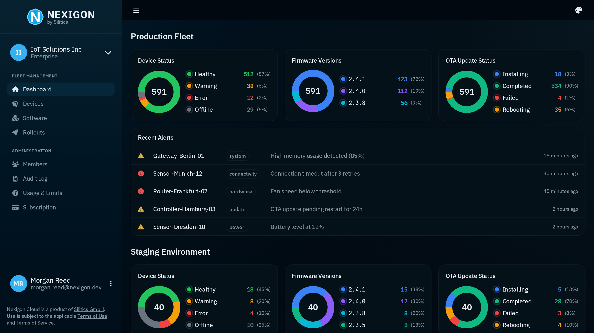

# Your Partner for Embedded Device Development

We provide **consulting**, **tools**, and **infrastructure** to accelerate and de-risk the development of embedded devices.

Our technology already powers tens of thousands of devices worldwide.

## Secure Remote Access & OTA Updates for Your Fleet

**Troubleshoot devices in seconds. Deploy updates with confidence.**

[Nexigon](https://nexigon.dev) provides a foundational **device management layer for you to build upon**:

- **Remote Access**: Securely access devices without complex VPN and firewall setups.
- **OTA Updates**: Orchestrate updates with best-in-class OSS solutions such as [Rugix](https://github.com/rugix), [RAUC](https://github.com/rauc/rauc), and others.
- **Configuration**: Easily configure devices remotely through custom JSON properties.
- **Telemetry**: Observe your fleet in real-time and resolve issues before they become problems.

**Stay on top of your fleet with Nexigon.**

While the Nexigon backend is proprietary, **all on-device components are open-source.**

[Get started for free today!](https://docs.nexigon.dev/getting-started) 🚀

## Open-Source Projects

We are also the authors and maintainers of the following open-source projects.

[Rugix](https://github.com/rugix) lets you **deploy updates to embedded Linux systems with confidence**:

- **A/B Updates**: Atomic system updates with automatic rollback on failure.
- **Delta Updates**: Highly-efficient update delivery minimizing bandwidth.
- **Signature Verification**: Secure cryptographic verification before installation.
- **State Management**: Flexible state management inspired by containers.
- **Vendor-Agnostic**: Compatible with various fleet management solutions.
- **Yocto Integration**: [Ready-made Yocto layers](https://github.com/rugix/meta-rugix) to get you started quickly.

[Rugix Bakery](https://github.com/rugix) lets you **build custom Linux distributions in days, not months**:

- **Container-Based Builds**: Reproducible build environment from source to image.
- **System Variants**: Support for multiple configurations including test setups.
- **Integrated Testing**: System testing framework with VM support.
- **SBOM Generation**: Built-in SBOM generation for regulatory compliance.
- **Robust Updates:** Integration with Rugix for seamless OTA updates.
- **Supported Distributions**: Debian, Alpine Linux, and Raspberry Pi OS.

**100% open-source and permissively licensed.** ❤️

## About Us

Silitics has been founded in 2021, it is is 100% privately owned, and led by its founder [@koehlma](https://github.com/koehlma).
